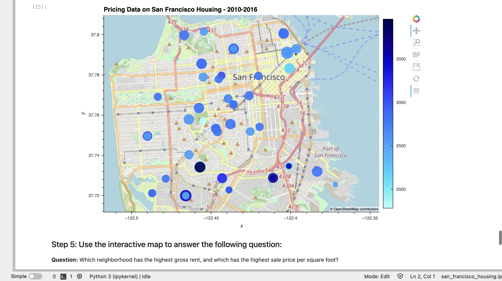

# Challenge-06
This is a Jupyter notebook that provides a set of data analysis and visualization tools to check the San Francisco real estate market for investment opportunities. Specifically, it will give users an easy but effective way of viewing investment opportunities to then rent out.

---
## Technologies
PyChain Ledger uses the following Python 3.7 libraries:
### **pandas** - for financial analysis.
### **hvplot** - for visualizations of financial analyses, which is part of the **PyViz** Python visualization package and also contains **geoviews**.
### **pathlib** - for the *Path* tool in uploading data onto Jupyter Lab
```python
import pandas as pd
import hvplot.pandas
from pathlib import Path
```
---
## Installation Guide
First, install the following on the **dev** environment, or whichever environment you would like to install **PyViz** on. Activate the environment in GitBash or Terminal, and run the following:
```
conda install -c pyviz hvplot geoviews
```
Then, navigate to the folder that contains this san_francisco_housing.ipynb file in GitBash or Terminal for Mac. Run the following:
```
jupyter lab san_francisco_housing.ipynb
```
It will open the user interface in a new window on your browser.

---
## Usage
You can adjust the toggles on the map (see screenshot below) to view detailed rent and price data by neighborhood.



---
## Contributors
Heeje Yoo - heeje90@pm.me

---
## License
Copyright 2022 Heeje Yoo

Permission is hereby granted, free of charge, to any person obtaining a copy of this software and associated documentation files (the "Software"), to deal in the Software without restriction, including without limitation the rights to use, copy, modify, merge, publish, distribute, sublicense, and/or sell copies of the Software, and to permit persons to whom the Software is furnished to do so, subject to the following conditions:

The above copyright notice and this permission notice shall be included in all copies or substantial portions of the Software.

THE SOFTWARE IS PROVIDED "AS IS", WITHOUT WARRANTY OF ANY KIND, EXPRESS OR IMPLIED, INCLUDING BUT NOT LIMITED TO THE WARRANTIES OF MERCHANTABILITY, FITNESS FOR A PARTICULAR PURPOSE AND NONINFRINGEMENT. IN NO EVENT SHALL THE AUTHORS OR COPYRIGHT HOLDERS BE LIABLE FOR ANY CLAIM, DAMAGES OR OTHER LIABILITY, WHETHER IN AN ACTION OF CONTRACT, TORT OR OTHERWISE, ARISING FROM, OUT OF OR IN CONNECTION WITH THE SOFTWARE OR THE USE OR OTHER DEALINGS IN THE SOFTWARE.